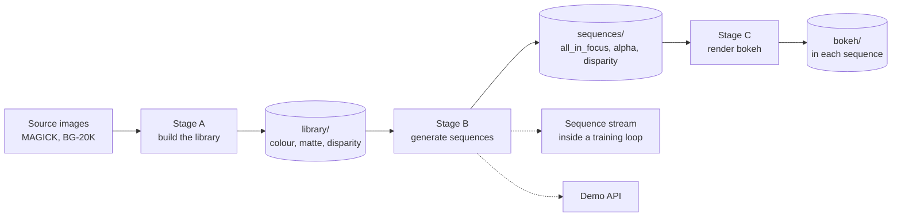

# How the pipeline works

A plain-language walkthrough of the three stages that make the synthetic data and its bokeh:
what each stage computes and why it is built this way.

No commands here. To run it, see [[generate-a-dataset]]. For what it writes, see
[[dataset-layout]].

---

## The big picture

We want to train a model that adds realistic blur to a video based on depth. That needs
training data where the distance of every pixel is known exactly. Real video does not come
with that, so we build synthetic video instead: cut-out objects composited onto backgrounds,
each with a depth we assigned and therefore know.

Three stages, split by cost. Stage A computes depth once per asset. Stage B turns those assets
into as many videos as you want. Stage C blurs each video by its depth.



- **Stages A and C take their model from a flag.** Stage A takes a depth estimator, Stage C a
  bokeh renderer, and either can be a class of your own. [[cli]] lists both.
- **The stages meet only through the files on disk.** That is what lets a model that cannot
  share our Python environment run in one of its own. [[0001-on-disk-formats-join-the-stages]]
  records why.
- **Cost rises at both ends.** Stage A runs a neural depth estimator and Stage B never does.
  Stage C runs a diffusion model and needs an NVIDIA card.

---

## Stage A — build the library

Run the depth estimator once per asset, clean the result, and save it.

### 1. Composite on a neutral background

A foreground is a cut-out with transparency. The depth model needs a full image, so the
object is pasted onto a backdrop first. That backdrop is deliberately not blank: it is
low-frequency noise around mid-gray, clipped to a narrow band, because a flat background gives
the model nothing to separate the object from. The composite is saved as `depth_input.png`, so
a bad depth map later can be traced to the model or to the compositing rather than guessed at.

### 2. Estimate depth

The model returns a disparity map — brighter means closer. This is saved untouched as
`depth_raw.png`, for diagnosis only.

Which model runs is a flag: Depth Anything V2 by default, Depth Pro, Depth Anything 3, or one
of your own. Every model hands back disparity, so nothing after this step knows which one ran.

### 3. Clean the trusted core

The estimator is not perfect. Around thin structures like hair it leaves black holes where it
had no confident estimate. Propagating depth outward from a hole spreads the black into a
large dark patch, so the holes are removed first.

The trusted core is built in three steps:

1. Erode the object's alpha mask inward, because borders are unreliable.
2. Drop any pixel in the eroded region whose depth falls below the 2nd percentile — those are
   the holes.
3. What remains is the core.

`meta.json` records how large the core was and how many holes were dropped, so a bad depth map
later can be traced to the estimator or to propagation without re-running Stage A.

### 4. Propagate to the full frame

Reliable values exist only inside the core, but compositing needs a value at every pixel.
Every pixel outside the core takes the depth of its nearest trusted pixel, and the result is
lightly blurred to soften the seams. That becomes `depth.png`.

Backgrounds skip all of this — they are already full-frame, so the estimator's output is
saved directly.

---

## Stage B — generate sequences

Pick a background and some objects, one to five by default, give each a motion path and a
depth trajectory, check nothing collides, render every frame.

### The disparity axis

Think of disparity as a ruler from 0 to 1. Zero is infinitely far, one is against the lens.
**Larger means closer**, throughout the pipeline — disparity is roughly proportional to
`1 / distance`.

The background takes the bottom sliver, `[0, 0.05]`. Everything above is divided between the
objects into disjoint **slots**, separated by small gaps:

```
Background:  [0.00 — 0.05]
Object 1:          [0.05 ————————————— 0.515]
Gap:                                          0.02
Object 2:                                     [0.535 ————————————— 1.00]
```

An object never fills its slot. It occupies a narrow **active band**, 0.08 wide by default,
and the rest is room to move.

### What the slot is for

**The slot constrains frame 1 and nothing after it.** That is the whole design.

An earlier version pinned each object inside its slot for the entire clip. Collisions were
then impossible by construction, which was safe and wrong: an object could never move past
another in depth, and a camera that sees something approach is exactly what we are modelling.
That version has been removed.

Letting objects leave their slots means two can end up at the same depth, so what used to be
guaranteed by construction is now checked instead.

### How a trajectory is built

1. Sample a start interval inside the object's slot.
2. Sample an end pose. Its on-screen scale implies the end interval, which is *derived*,
   never sampled: growing on screen by a factor `k` means getting `k` times closer, so the
   whole interval is multiplied by `k`.
3. If the derived interval leaves `[0.05, 1.0]`, throw the pose away and draw another. After
   100 tries, fall back to holding the start scale, which always fits. The manifest counts
   these fallbacks.
4. Every frame in between interpolates the interval from start to end.

**The law is `ratio = scale_end / scale_start`, not its reciprocal.** Apparent size and
disparity are both proportional to `1 / distance`, so they rise and fall together. The
approved research spec writes the reciprocal because it derives the rule for depth-as-distance
and then applies the formula to a disparity interval. Taken literally it makes an object that
grows on screen recede in the depth stream — exactly the inconsistency this design exists to
remove. The code is right and the spec's formula is not; `derive_end_range` in
`src/video_bokeh/core/_trajectory.py` carries the argument in full.

An object coming closer therefore occupies a *wider* disparity interval, because the whole
interval scales. That is physically correct: the nearer something is, the more depth it spans.

### Collision validation

Two objects can end up overlapping on screen while sharing a depth.
That sample has no defensible depth ordering and would teach the model something untrue.

Every frame is checked for pairs that overlap in alpha **and** in disparity interval. A
2D overlap alone is fine — that is just occlusion. If any frame collides, the whole trajectory
set is discarded and resampled, up to 50 times, after which the sequence is skipped rather
than written. The manifest records the rejection count.

### Rendering a frame

1. Warp the background's colour and depth by its homography.
2. Sort objects by the centre of their disparity interval **for this frame**, far to near.
3. For each, in that order: warp its colour and depth, stretch its depth into its interval for
   this frame, alpha-composite it onto the canvas, and record its mask separately.
4. Write the three streams.

**Paint order is recomputed every frame.** Two objects that swap depth mid-clip swap which one
occludes the other, which is the whole point of letting them move.

**Each object keeps one alpha page for the whole clip**, even as paint order changes. The
masks are recorded before occlusion is resolved, so they are independent soft layers, not a
partition of the frame — a renderer can blur each layer separately and then composite. That
independence is also why a single index or label map cannot stand in for them: two objects
can be partly transparent at the same pixel.

**The layers themselves can be written too.** With `--layers`, Stage B also writes what each
frame was composited from: the whole background, each whole object with its own disparity, and
the paint order. A layer-wise bokeh renderer needs exactly this, because the composite no longer
holds what a blurred object in front would let through.
[[0002-layers-are-stored-not-regenerated]] records why they are stored rather than regenerated.

---

## Stage C — render bokeh

A bokeh renderer reads a finished sequence and writes what a camera with a shallow focus would
have recorded: the `bokeh` stream, one frame for every `all_in_focus` frame.

any-to-bokeh is the first renderer. It is a diffusion model with its own Python environment, so
Stage C runs it as a separate program and reads its result back. By default the focus follows
one object per sequence, drawn with odds in proportion to its area, so one object is sharp and
the others blur by how far they are from it in depth. Stage C first ran end to
end on 2026-10-07, on an RTX 5090, and [[run-any-to-bokeh-inference]] says where it stands.

---

## How the stages connect

Stage B never calls the depth model. It reads the library's precomputed maps and warps them
with the same homography as the colour. Three things follow:

- **Depth stays aligned with the object** as it pans, rotates and scales, because both go
  through the same transform.
- **Thousands of videos come from a small library**, since sampling is cheap and estimation
  already happened.
- **Temporal consistency is free.** One depth map per asset, warped per frame, cannot flicker
  the way per-frame estimation would.

A sequence is also reproducible. Sampling is deterministic, so the library, the seed and the
run's settings — frame count, size, the object range and the sampling configuration —
regenerate it exactly. The manifest records the seed, the frame count and the size.

**Stage B also runs inside training.** The sequence stream, [[loader]], calls the same Stage B
for every item a training loop asks for and writes nothing. A model can then train on as many
sequences as it likes, from the same distribution as the written dataset.

---

## Related

- [[dataset-layout]] — the on-disk contract, with formats and bit depths
- [[generate-a-dataset]] — how to run Stages A and B
- [[run-any-to-bokeh-inference]] — how to run Stage C
- [[loader]] — the sequence stream, for training on the fly
- [[demo-unrestricted-trajectories]] — how to judge the result by eye
- [[meetings/2026-06-26-unrestricted-pipeline-algorithm]] — where the unrestricted design was agreed
