# Drive a task from idea to merge with the agent

Three slash commands cover the whole lifecycle. You answer questions, confirm the acceptance criteria, and merge. You can also hand a batch over: tell the agent it may merge a set of pull requests you name, each under root `AGENTS.md` Git workflow rule 2. The agent picks which of the phases below a task needs and runs them.

## The three commands

| Command | When | Ends with |
|---|---|---|
| `/bokeh-meeting <fathom link>` | after a sync with Pablo and Valery | a meeting note in `docs/meetings/` |
| `/bokeh-task <action item, or the idea in your words>` | to start any piece of work | an open pull request, or a written finding when there is nothing to build |
| `/bokeh-review <PR number>` | in a **new** session, once a pull request exists | a review on GitHub and a verdict: ready to merge, or what blocks it |

`/bokeh-review` runs in its own session on purpose. The session that wrote the code knows what it meant, so it reads its own diff generously. A fresh session sees only the diff and the spec, the way a human reviewer would.

A task does not need a meeting behind it. When you already know the product decision, start with `/bokeh-task` and describe it.

## The flow

```mermaid
flowchart TD
    MEET["/bokeh-meeting"] -->|"meeting note"| TRIAGE
    IDEA["Your own idea"] --> TRIAGE

    subgraph S1 ["Session 1: /bokeh-task"]
        TRIAGE["Triage the route"] --> NEW{"From a meeting,<br/>or a new direction?"}
        NEW -->|"new direction"| CEO["plan-ceo-review<br/>selective expansion"]
        NEW -->|"already scoped"| GRILL
        CEO --> GRILL["grilling + domain-modeling"]
        GRILL --> OK1{{"You confirm the<br/>acceptance criteria"}}
        OK1 --> ROUTE{"Route"}
        ROUTE -->|"feature"| SPEC["to-spec"]
        SPEC --> RISK{"Contract, API<br/>or render speed?"}
        RISK -->|"yes"| ENG["plan-eng-review"]
        RISK -->|"no"| BIG
        ENG --> BIG{"Bigger than<br/>one session?"}
        BIG -->|"yes"| TICKETS["to-tickets"]
        BIG -->|"no"| TDD
        TICKETS --> TDD
        ROUTE -->|"bug"| DIAG["diagnosing-bugs"]
        DIAG --> TDD["tdd"]
        TDD --> VERIFY["Tests, lint, types,<br/>commit"]
        VERIFY --> SELF["two-axis-review<br/>fresh-context self-check"]
        SELF --> PUSH["Local checks, push,<br/>open the pull request"]
    end

    PUSH --> CI["CI: pre-commit, tests, frontend build,<br/>browser smoke, Docker"]

    subgraph S2 ["Session 2: /bokeh-review"]
        LENSES["two-axis-review + /code-review<br/>history, threads, docs style,<br/>document-release"] --> HIGH{"High-risk?"}
        HIGH -->|"yes"| CODEX["codex second opinion"]
        HIGH -->|"no"| GATE
        CODEX --> GATE["Notation gate"]
        GATE --> QA["qa: browser or pipeline run"]
        QA --> LEFT{"Must-fix left?"}
        LEFT -->|"yes, up to 3 rounds"| FIX["Fix and commit"]
        FIX --> LENSES
        LEFT -->|"no"| PUSHFIX["Local checks,<br/>push the fixes"]
        PUSHFIX --> PUBLISH["Review on GitHub"]
    end

    CI --> LENSES

    PUBLISH --> MERGE{{"You merge, or hand<br/>the batch over"}}
```

The hexagons are yours. Everything else runs without you. Routes that build nothing, such as an investigation or a literature search, end with a written finding once you confirm the criteria, and never reach a branch.

## What runs for which task

| Task | Session 1 runs | Session 2 adds |
|---|---|---|
| Small bug | `diagnosing-bugs`, `tdd`, self-check | lenses, notation gate, `qa` |
| Ordinary feature | grilling, `to-spec`, `tdd`, self-check | lenses, notation gate, `qa` |
| New direction | CEO review first, then as a feature | as a feature |
| Changes the dataset contract or the API | `plan-eng-review` after the spec | `codex` second opinion |

## A worked example

Say you want the demo to export a scene as EXR, and no meeting asked for it.

**Session 1**

1. Type `/bokeh-task add EXR export to the scene viewer`.
2. The agent states the route in one line: feature, no meeting behind it. Correct it if it is wrong.
3. It offers a CEO review, because nobody scoped this yet. Say yes, and it lists what would make the feature noticeably stronger, kept apart from what you asked for. Pick the ones worth taking. Anything that changes what the dataset contains or what the paper claims comes back as a draft email to Pablo and Valery, not as code.
4. Grilling starts. Each round is a short numbered list of questions, every one with the agent's recommended answer. Reply with the numbers you disagree with. New terms land in `CONTEXT.md` as they are settled.
5. The agent restates the goal and the acceptance criteria as a checklist. **This is the checkpoint that matters most**: a wrong criterion here costs a rebuilt feature later. Say yes, or fix the list.
6. It writes the spec to `docs/specs/` and confirms where the tests will sit. Then it branches and builds test-first.
7. A fresh-context self-check compares the diff against the repo rules and the spec, and the agent fixes what it finds.
8. It runs the checks that the **Pushing** section of `.claude/skills/shared/bokeh-conventions.md` asks for before a push. For a frontend change like this one, they include the browser smoke test. Then it pushes the branch and opens the pull request, without asking.
9. It ends by naming the next step: a new session, `/bokeh-review` with the PR number.

**Session 2**

1. Open a new session and type `/bokeh-review 15`.
2. The agent reads the spec behind the branch, then the diff through each review lens.
3. It runs the page in a browser and syncs any documentation the change made stale.
4. On your own branch it fixes what it found, at most three rounds. It runs the same checks, then pushes the fixes.
5. It publishes one review on GitHub and tells you whether the PR is ready to merge.
6. You merge — or the agent does, when you have handed this batch of pull requests over.

## Where things end up

| Artifact | Location | In git |
|---|---|---|
| Spec | `docs/specs/YYYY-MM-DD-<branch-slug>-design.md` | no |
| Tickets for a big feature | `docs/plans/YYYY-MM-DD-<branch-slug>/` | no |
| Glossary of project terms | `CONTEXT.md` | yes |
| Decisions that are hard to reverse | `docs/adr/` | yes |
| The review | the pull request on GitHub | — |

`.claude/skills/shared/bokeh-conventions.md` lists every skill the three commands call and the ones deliberately left out.
